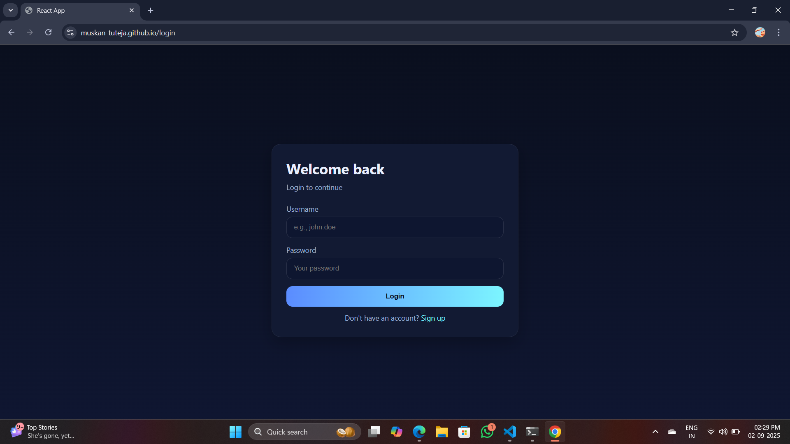

# React Login & Sign-Up App

A simple React application demonstrating a Login and Sign-Up flow with routing, reusable components, responsive styling, and inline validations.

## ✨ Features
- React Router navigation between Login and Sign-Up
- Input field validations:
  - Name → Alphabets only
  - Username → Alphanumeric + special chars
  - Password → Must not equal username
  - Confirm Password → Matches password
  - Email → Gmail only
  - Phone → Country code + number (e.g., +91 9876543210)
- Inline error messages under each input
- Reusable `TextInput` component
- Responsive design

## 🚀 Getting Started

### 1. Clone the repository
```bash
git clone https://github.com/muskan-tuteja/login-signup-app.git
cd login-signup-app

2. Install dependencies
npm install

3. Run the app
npm start


4. Screenshots

### Login Page


### Sign-Up Page


5.Tech Stack

React (Create React App)

React Router DOM

CSS (custom styling)
